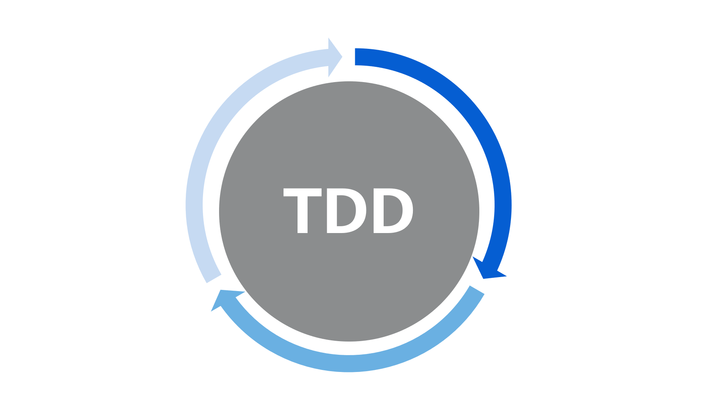

  

 

  
   
   
  
  <h3>🎓 Estudiante avanzado de Ingeniería en Informática en la Universidad de Mendoza, enfocado en la construcción de soluciones de software escalables y resilientes, y apasionado por la intersección entre el desarrollo backend, la inteligencia artificial y la arquitectura en la nube. ☁️</h3>

 
 
 
 

<!-- 🔥 Backend -->

  

<table align="center" style="border: 2px solid #000000;">
  <tr>
    <td align="center" width="96" style="border: 1px solid #000000;">
      
       Python
    </td>
    <td align="center" width="96" style="border: 1px solid #000000;">
      
       Java
    </td>
    <td align="center" width="96" style="border: 1px solid #000000;">
      
       Flask
    </td>
    <td align="center" width="96" style="border: 1px solid #000000;">
      
       Spring
    </td>
  </tr>
</table>

<!-- ⚡ Frontend -->

  

<table align="center" style="border: 2px solid #000000;">
  <tr>
    <td align="center" width="96" style="border: 1px solid #000000;">
      
       JavaScript
    </td>
    <td align="center" width="96" style="border: 1px solid #000000;">
      
       TypeScript
    </td>
    <td align="center" width="96" style="border: 1px solid #000000;">
      
       React
    </td>
    <td align="center" width="96" style="border: 1px solid #000000;">
      
       Tailwind
    </td>
  </tr>
</table>

<!-- 💾 Bases de Datos -->

  

<table align="center" style="border: 2px solid #000000;">
  <tr>
    <td align="center" width="96" style="border: 1px solid #000000;">
      
       PostgreSQL
    </td>
    <td align="center" width="96" style="border: 1px solid #000000;">
      
       MySQL
    </td>
    <td align="center" width="96" style="border: 1px solid #000000;">
      
       Redis
    </td>
    <td align="center" width="96" style="border: 1px solid #000000;">
      
       SQLAlchemy
    </td>
  </tr>
</table>

<!-- ☁️ Cloud & DevOps -->

  

<table align="center" style="border: 2px solid #000000;">
  <tr>
    <td align="center" width="96" style="border: 1px solid #000000;">
      
       AWS
    </td>
    <td align="center" width="96" style="border: 1px solid #000000;">
      
       Azure
    </td>
    <td align="center" width="96" style="border: 1px solid #000000;">
      
       Docker
    </td>
    <td align="center" width="96" style="border: 1px solid #000000;">
      
       Actions
    </td>
  </tr>
</table>

<!-- 🤖 IA & Automatización -->

  

<table align="center" style="border: 2px solid #000000;">
  <tr>
    <td align="center" width="96" style="border: 1px solid #000000;">
      
       OpenAI
    </td>
    <td align="center" width="96" style="border: 1px solid #000000;">
      
       Keras
    </td>
    <td align="center" width="96" style="border: 1px solid #000000;">
      
       n8n
    </td>
  </tr>
</table>

<!-- 🧠 Arquitectura de Desarrollo -->

  

<table align="center" style="border: 2px solid #000000;">
  <tr>
    <td align="center" width="96" style="border: 1px solid #000000;">
      
       REST / API
    </td>
    <td align="center" width="96" style="border: 1px solid #000000;">
      
       Microservices
    </td>
    <td align="center" width="96" style="border: 1px solid #000000;">
      
       TDD
    </td>
    <td align="center" width="96" style="border: 1px solid #000000;">
      
       Docker
    </td>
  </tr>
  <tr>
    <td align="center" width="96" style="border: 1px solid #000000;">
      
       CI/CD
    </td>
    <td align="center" width="96" style="border: 1px solid #000000;">
               JWT / OAuth
    </td>
    <td align="center" width="96" style="border: 1px solid #000000;">
      
       Hexagonal
    </td>
    <td align="center" width="96" style="border: 1px solid #000000;">
      
       n8n
    </td>
  </tr>
</table>

<!-- ⚙️ Principios de Desarrollo -->
<!-- 🏗️ Patrones de Diseño y Otros -->

  

<table align="center" style="border: 2px solid #000000; border-collapse: collapse;">
  <tr>
    <td align="center" width="120" style="border: 1px solid #000000; background: linear-gradient(135deg, #2d1b69 0%, #1a1a2e 100%); color: #FF0080; padding: 15px;">
      
🔒

      <strong>Singleton</strong>
    </td>
    <td align="center" width="120" style="border: 1px solid #000000; background: linear-gradient(135deg, #2d1b69 0%, #1a1a2e 100%); color: #FF0080; padding: 15px;">
      
🏭

      <strong>Factory Method</strong>
    </td>
    <td align="center" width="120" style="border: 1px solid #000000; background: linear-gradient(135deg, #2d1b69 0%, #1a1a2e 100%); color: #FF0080; padding: 15px;">
      
🎨

      <strong>Decorator</strong>
    </td>
    <td align="center" width="120" style="border: 1px solid #000000; background: linear-gradient(135deg, #4a1a3a 0%, #2d1b29 100%); color: #FFD700; padding: 15px;">
      
🧪

      <strong>Abstract Method</strong>
    </td>
  </tr>
  <tr>
    <td align="center" width="120" style="border: 1px solid #000000; background: linear-gradient(135deg, #0f3460 0%, #16213e 100%); color: #00FF80; padding: 15px;">
      
🏗️

      <strong>MVC</strong>
    </td>
    <td align="center" width="120" style="border: 1px solid #000000; background: linear-gradient(135deg, #0f3460 0%, #16213e 100%); color: #00FF80; padding: 15px;">
      
📚

      <strong>Repository</strong>
    </td>
    <td align="center" width="120" style="border: 1px solid #000000; background: linear-gradient(135deg, #1a1a1a 0%, #2d2d2d 100%); color: #00FFFF; padding: 15px;">
      
🔧

      <strong>SOLID</strong>
    </td>
    <td align="center" width="120" style="border: 1px solid #000000; background: linear-gradient(135deg, #1a1a1a 0%, #2d2d2d 100%); color: #00FFFF; padding: 15px;">
      
🚀

      <strong>KISS</strong>
    </td>
  </tr>
  <tr>
    <td align="center" width="120" style="border: 1px solid #000000; background: linear-gradient(135deg, #1a1a1a 0%, #2d2d2d 100%); color: #00FFFF; padding: 15px;">
      
🔄

      <strong>DRY</strong>
    </td>
    <td align="center" width="120" style="border: 1px solid #000000; background: linear-gradient(135deg, #1a1a1a 0%, #2d2d2d 100%); color: #00FFFF; padding: 15px;">
      
⚡

      <strong>YAGNI</strong>
    </td>
    <td align="center" width="120" style="border: 1px solid #000000; background: linear-gradient(135deg, #1a1a1a 0%, #2d2d2d 100%); color: #00FFFF; padding: 15px;">
      
🎯

      <strong>SRP</strong>
    </td>
    <td></td>
  </tr>
</table>

<!-- 📊 GitHub Stats -->

 
<strong>ESTADÍSTICAS DEL SISTEMA</strong>

 

<!-- 🔗 Conexión -->

<strong>CONTACTO</strong>

